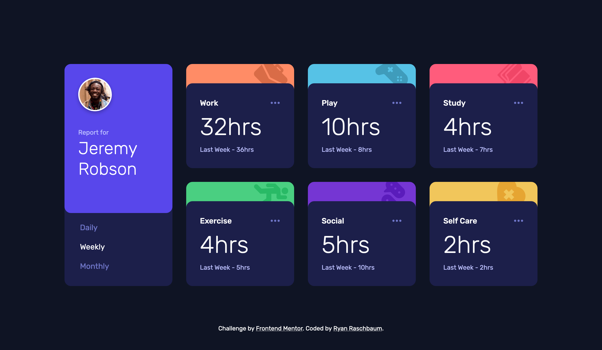

# Frontend Mentor - Time tracking dashboard solution

This is a solution to the [Time tracking dashboard challenge on Frontend Mentor](https://www.frontendmentor.io/challenges/time-tracking-dashboard-UIQ7167Jw). Frontend Mentor challenges help you improve your coding skills by building realistic projects.

## Table of contents

- [Overview](#overview)
  - [The challenge](#the-challenge)
  - [Screenshot](#screenshot)
  - [Links](#links)
- [My process](#my-process)
  - [Built with](#built-with)
  - [What I learned](#what-i-learned)
  - [Continued development](#continued-development)
- [Author](#author)
- [Acknowledgments](#acknowledgments)

## Overview

### The challenge

Users should be able to:

- View the optimal layout for the site depending on their device's screen size
- See hover states for all interactive elements on the page
- Switch between viewing Daily, Weekly, and Monthly stats

### Screenshot

### Links

- [Solution](https://github.com/rraschbaum/time-tracking-dashboard)
- [Live Site](https://62b2529ff8dafd007cda752a--lighthearted-dasik-0f8425.netlify.app/)

## My process

### Built with

- Semantic HTML5 markup
- CSS custom properties
- Flexbox
- CSS Grid
- [React](https://reactjs.org/) - JS library
- [Styled Components](https://styled-components.com/) - For styles
- [SVGR](https://react-svgr.com/) - To automate transforming SVG icons to components

### What I learned

This was a great project to work with CSS grid a bit more. Previously I've stuck to flexbox, but I'm working on challenging myself to start using both.

I was able to get a bit of fluid design practice in. I spent a lot of time fussing with my break points and thinking about the responsiveness of this site. I made use of clamping and minmax to control how the site scalled. I also designed my own two column tablet solution because I didn't want to the single column to be too wide or to have too much space around it once the three column needed to break based on the content size.

### Continued development

This project made me realize that I should focus more on learning the intricacies of SVG. A lot of my previous experience with icons has been with icon packages that have taken care of a lot of setup so using SVG icons was a bit of a challenge. I spent some time figuring out the best way to use and setup SVGs for a react project. I ended up using [SVGR](https://react-svgr.com/) to transform the supplied icons into individual components. I had to do a bit of reading and tinkering to figure out how to control the fill color which wasn't a huge issue until I needed to work on the hover state for the ellipses. I'd also like to focus more on practicing and experimenting with animation on future projects.

## Author

- Frontend Mentor - [@rraschbaum](https://www.frontendmentor.io/profile/rraschbaum)

## Acknowledgments

I've wrapped up 87% of Josh W Comeau's [CSS for JavaScript Developers](https://courses.joshwcomeau.com/) course and I would highly recommend it. This is the first project I've built outside of the course projects and I felt much more confident in my styling abilities. I tried this project once before and got hung up on the layered cards. Upon trying this again, with some of what I learned in the course, I was able to knock that part out pretty quick. It really helped me with a ton of other aspects of this project as well, including the fluid layout and typography stuff utilizing clamping. Those are just a few examples.'
